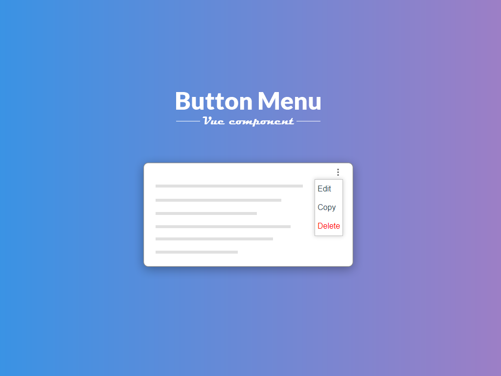

## Table of contents
* [General](#general)
* [Setup](#setup)
* [Usage](#usage)
* [Object options](#object-options)
* [Props](#props)
* [Slots](#slots)

# General
Vue component, that allows you to create button with dropdown menu

component is created with:
* Vue 2.6.10



# Setup
install module locally with npm or yarn

`npm i @pbartkowicz/buttonmenu`

or

`yarn add @pbartkowicz/buttonmenu`

# Usage
Import

```
import buttonmenu from '@pbartkowicz/buttonmenu'
```

Register in components section

```
components:{
    buttonmenu,
},
```

Define array with options

```
data(){

    return{

        yourArrayWitOptions:[
            'option1',
            'option2',
            'option3'
        ],

    }

}
```
Use component in your code

```
<buttonmenu :options="yourArrayWitOptions"/>
```

You allways can define array with objects

```
data(){

    return{

        yourArrayWitOptions:[
            {name: 'option1'},
            {name: 'option2'},
            {name: 'option3'}
        ],

    }

}
```

And then define <b>label</b> prop for displayed value in dropdown

```
<buttonmenu :options="yourArrayWitOptions" label="name"/>
```

# Object options
When you will define array with objects, you can pass in to objects options: 

| Option      | Type   | Default | Required | Description                                                                                 |
| ----------- | ------ | ------- | -------- | ------------------------------------------------------------------------------------------- |
| class       | String |         | No       | Name of class for option.                                                                   |
| disabled    | Boolean|         | No       | Option to disable item.                                                                     |
| callback    | String |         | No       | Name of emmit                                                                               |

```
data(){

    return{

        yourArrayWitOptions:[
            {name: 'option1', class: 'your-class-for-option'},
            {name: 'option2', disabled: true},
            {name: 'option3', callback: 'yourEmmit'}
        ],

    }

}
```

In this case 'option1' will have class "your-class-for-option" and 'option2' will be disabled.
When You select 'option3' then buttonmenu component will emmit 'yourEmmit'

```
<buttonmenu :options="yourArrayWitOptions" label="name" @yourEmmit="callYourFunction()"/>
```

# Props

| Prop        | Type   | Default | Required | Description                                                                                 |
| ----------- | ------ | ------- | -------- | ------------------------------------------------------------------------------------------- |
| options     | Array  |         | No       | Array with dropdown options.                                                                |
| label       | String |         | No       | Displayed value in dropdown from object in array.                                           |

# Slots
There is avaible slot to define your own icon

```
<vueselect :options="yourArrayWitOptions" label="name">
    <template v-slot:icon>
        
    </template>
<vueselect/>
```